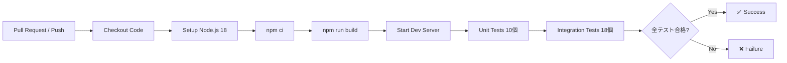
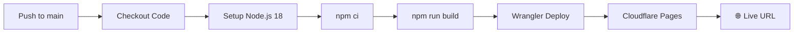

# GitHub Actions セットアップガイド

**作成日**: 2025年11月8日  
**バージョン**: 1.0.0  
**対象**: リポジトリ管理者

---

## 📋 概要

このガイドでは、My Agent Analytics プロジェクトのCI/CD自動化（GitHub Actions）をセットアップする手順を説明します。

**実装済みワークフロー**:
1. **test.yml** - 自動テスト（28テスト: ユニット10 + インテグレーション18）
2. **deploy.yml** - Cloudflare Pages自動デプロイ

---

## ⚠️ 重要な注意事項

### GitHub App権限制限について

現在、GenSpark GitHub Appには**workflows permission**がないため、`.github/workflows/`ディレクトリのファイルを直接プッシュできません。

**エラーメッセージ例**:
```
! [remote rejected] main -> main (refusing to allow a GitHub App to create or update workflow `.github/workflows/deploy.yml` without `workflows` permission)
```

**対処方法**: 手動でGitHub Web UIからファイルを作成する必要があります。

---

## 🔧 セットアップ手順

### ステップ1: Cloudflare API Tokenの準備

1. Cloudflare Dashboardにログイン: https://dash.cloudflare.com/
2. 右上のアカウントアイコン → **My Profile** をクリック
3. 左メニューから **API Tokens** を選択
4. **Create Token** をクリック
5. **Edit Cloudflare Workers** テンプレートを選択
6. 以下の設定を確認:
   - **Permissions**: 
     - Account - Cloudflare Pages: Edit
     - Account - Workers Scripts: Edit
   - **Account Resources**: 自分のアカウントを選択
   - **Zone Resources**: All zones
7. **Continue to summary** → **Create Token** をクリック
8. 表示されたトークンを**安全な場所にコピー**（再表示不可）

---

### ステップ2: GitHubシークレットの設定

1. GitHubリポジトリを開く: https://github.com/karis-org/My-Agent-Analitics-genspark
2. **Settings** タブをクリック
3. 左メニューから **Secrets and variables** → **Actions** を選択
4. **New repository secret** をクリック
5. 以下のシークレットを追加:

   **Name**: `CLOUDFLARE_API_TOKEN`  
   **Secret**: (ステップ1でコピーしたトークンを貼り付け)

6. **Add secret** をクリック

---

### ステップ3: Workflow ファイルの手動作成

#### 3-1. test.yml の作成

1. GitHubリポジトリのメインページに移動
2. `.github/workflows/` ディレクトリを作成:
   - **Add file** → **Create new file** をクリック
   - ファイル名に `.github/workflows/test.yml` と入力
3. 以下の内容をコピー＆ペースト:

```yaml
name: Test Suite

on:
  pull_request:
    branches: [ main ]
  push:
    branches: [ main ]

jobs:
  test:
    runs-on: ubuntu-latest
    
    steps:
      - name: Checkout code
        uses: actions/checkout@v4
      
      - name: Setup Node.js
        uses: actions/setup-node@v4
        with:
          node-version: '18'
          cache: 'npm'
      
      - name: Install dependencies
        run: npm ci
      
      - name: Build project
        run: npm run build
      
      - name: Start development server
        run: npm run dev:sandbox &
      
      - name: Wait for server
        run: sleep 10
      
      - name: Run unit tests
        run: bash tests/unit-tests.sh
      
      - name: Run integration tests
        run: bash tests/integration-tests.sh
```

4. **Commit changes** をクリック
   - Commit message: `Add GitHub Actions test workflow`
   - **Commit directly to the main branch** を選択
   - **Commit changes** をクリック

#### 3-2. deploy.yml の作成

1. 同じく **Add file** → **Create new file** をクリック
2. ファイル名に `.github/workflows/deploy.yml` と入力
3. 以下の内容をコピー＆ペースト:

```yaml
name: Deploy to Cloudflare Pages

on:
  push:
    branches: [ main ]

jobs:
  deploy:
    runs-on: ubuntu-latest
    
    steps:
      - name: Checkout code
        uses: actions/checkout@v4
      
      - name: Setup Node.js
        uses: actions/setup-node@v4
        with:
          node-version: '18'
          cache: 'npm'
      
      - name: Install dependencies
        run: npm ci
      
      - name: Build project
        run: npm run build
      
      - name: Deploy to Cloudflare Pages
        uses: cloudflare/wrangler-action@v3
        with:
          apiToken: ${{ secrets.CLOUDFLARE_API_TOKEN }}
          command: pages deploy dist --project-name=my-agent-analytics
```

4. **Commit changes** をクリック
   - Commit message: `Add GitHub Actions deploy workflow`
   - **Commit directly to the main branch** を選択
   - **Commit changes** をクリック

---

### ステップ4: 動作確認

#### テストワークフローの確認

1. GitHubリポジトリの **Actions** タブを開く
2. 左サイドバーから **Test Suite** を選択
3. 最新のワークフロー実行をクリック
4. 全てのステップが緑色のチェックマーク✅になっていることを確認

**期待される結果**:
```
✅ Checkout code
✅ Setup Node.js
✅ Install dependencies
✅ Build project
✅ Start development server
✅ Wait for server
✅ Run unit tests (10/10 PASS)
✅ Run integration tests (18/18 PASS)
```

#### デプロイワークフローの確認

1. **Actions** タブ → **Deploy to Cloudflare Pages** を選択
2. 最新のワークフロー実行をクリック
3. **Deploy to Cloudflare Pages** ステップを展開
4. デプロイURLが表示されることを確認

**期待される結果**:
```
✅ Checkout code
✅ Setup Node.js
✅ Install dependencies
✅ Build project
✅ Deploy to Cloudflare Pages
   ✨ Deployment complete! Take a peek over at https://[hash].my-agent-analytics.pages.dev
```

---

## 🔍 トラブルシューティング

### エラー: "secrets.CLOUDFLARE_API_TOKEN not found"

**原因**: Cloudflare API Tokenが設定されていない

**解決方法**:
1. **Settings** → **Secrets and variables** → **Actions** を確認
2. `CLOUDFLARE_API_TOKEN` シークレットが存在するか確認
3. 存在しない場合は、ステップ2に戻って設定

---

### エラー: "Wrangler authentication failed"

**原因**: API Tokenの権限が不足している

**解決方法**:
1. Cloudflare Dashboardで新しいトークンを作成
2. **Edit Cloudflare Workers** テンプレートを使用
3. 以下の権限が付与されているか確認:
   - Account - Cloudflare Pages: Edit
   - Account - Workers Scripts: Edit
4. 新しいトークンでGitHubシークレットを更新

---

### テストが失敗する

**原因**: 依存関係の問題、テストスクリプトの問題

**解決方法**:
1. ローカル環境で `npm test` を実行し、同じエラーが発生するか確認
2. エラーログを確認し、失敗したテストを特定
3. 必要に応じて `tests/unit-tests.sh` または `tests/integration-tests.sh` を修正

---

### デプロイは成功するがサイトが動作しない

**原因**: 環境変数の未設定、D1データベースの未適用

**解決方法**:
1. Cloudflare Pages Dashboardを開く
2. **Settings** → **Environment variables** を確認
3. 必要な環境変数が設定されているか確認:
   - `GOOGLE_CLIENT_ID`
   - `GOOGLE_CLIENT_SECRET`
   - `REINFOLIB_API_KEY`
   - `SESSION_SECRET`
   - その他のAPIキー
4. D1データベースのマイグレーションを確認:
   ```bash
   npx wrangler d1 migrations list webapp-production
   ```

---

## 📊 ワークフローの仕組み

### test.yml の動作フロー



### deploy.yml の動作フロー



---

## 🎯 CI/CDの利点

### 自動テスト
- **Pull Request時**: コードレビュー前にテストが自動実行
- **マージ前チェック**: 壊れたコードのマージを防止
- **継続的な品質保証**: 28テストが常に実行される

### 自動デプロイ
- **mainブランチへのpush**: 即座に本番環境にデプロイ
- **デプロイ履歴**: GitHub Actionsで全てのデプロイを追跡
- **ロールバック簡単**: 過去のコミットに戻すだけ

---

## 📚 関連ドキュメント

- **GitHub Actions公式ドキュメント**: https://docs.github.com/en/actions
- **Cloudflare Pages CI/CD**: https://developers.cloudflare.com/pages/how-to/use-direct-upload-with-continuous-integration/
- **Wrangler Action**: https://github.com/cloudflare/wrangler-action

---

## 📞 サポート

問題が解決しない場合は、GitHubのIssueを作成してください:
https://github.com/karis-org/My-Agent-Analitics-genspark/issues

---

**最終更新**: 2025年11月8日  
**バージョン**: 1.0.0
